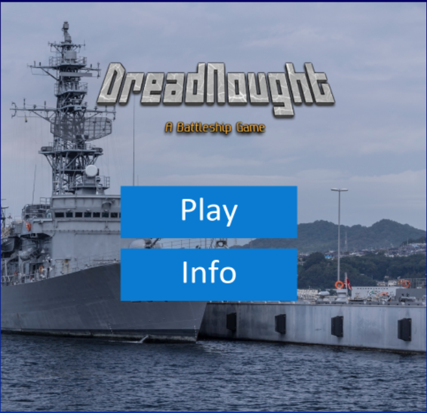
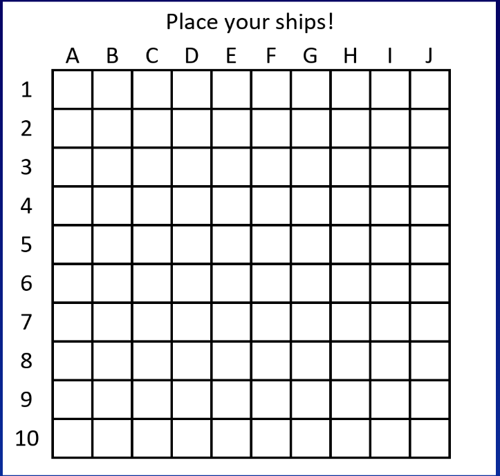
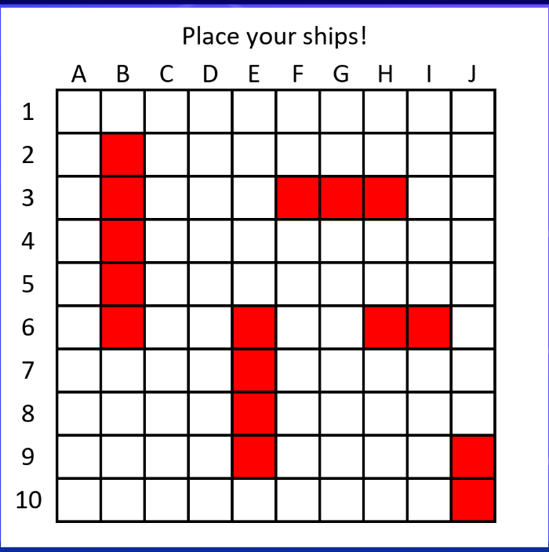
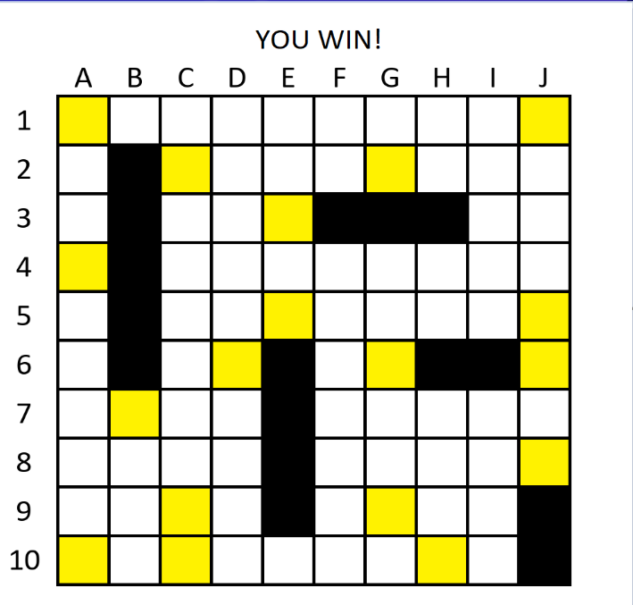

# DreadNought - Readme

## Screenshots

|  |  |
| --------------- | --------------- |
|  |  |

## Introduction

**DreadNought** is a game based upon well-known classic game of **[Battleship](https://en.wikipedia.org/wiki/Battleship)**. In this two-player game you place *ships* of varying lengths onto a grid of 10x10 tiles. In this game each player is not allowed to see the other player's board, instead the players take turns firing *missiles* onto the opponents board and are told if they hit a ship or not. ***The objective of the game*** is to sink all of your opponents ships, at which point you have won. 

## Installing and Running

1. Ensure you have [Python](https://www.python.org/) installed (version `3.4.0` or newer!)

2. Download this repository (zip or clone) from this page

3. Run the launch script

   - **Windows users**: `launch.bat`

      - If you dont have Python on your path, the script will attempt to locate it automatically, note that this can take some time. If it fails to find the executable, please [add it to you path](https://superuser.com/questions/143119/how-do-i-add-python-to-the-windows-path).

   - **Mac OSX and Linux users**: `launch.sh`

      - **Linux users**: Note that this script launches `setup.py` which will attempt to install missing modules for you using Python's pip (namely, `pygame` and `crayons`). If you install Python modules using a different package manager or to a different location, feel free to modify the setup file accordingly **or**:

         ```bash
         cd src
         python3 main.py
         ```
<<<<<<< HEAD

## Documentation
Class Controller: used to play a battleship game with 2 human players. It executes what the player wants (ie where to place a ship, where to hit) by calling on the methods from the board file.

def place_ship(self, start: tuple[int, int], end: tuple[int,int],ship: str) -> bool:

First, this method checks if it can place the desired ship at the given position. Then, if possible, it places the ship on the board by calling the required board method and returns true. Otherwise, the ship is not placed and the method returns false.

def move_hit(self, player: str, coord: tuple[int, int]) -> bool:

The method records a move by placing on the player’s board whether his shot was a hit or a miss. It returns true if a ship was hit and false if not.

def is_game_over(self) -> bool:

This method determines if the game is over or not. Since there are 5 ships with a total of 17 spaces to hit, the game is over when one of the players has a total number of hits of 17.


## EXTENSION EXAMPLE
The AIPlayer class can be amended and edited to be attached to a future implementation and extension of the game. The class is currently fairly abstract in its design and has documentation explaining its functionality. For instance, AI ship placement is currently missing from the class and is required for a fully autonomous opponent.

## INDIVIDUAL CONTRIBUTIONS

### George
> I contributed most of what can be found in in the `gui` folder under `src` including the `App` class and `Button` class. Additionally, I am solely responsible for the system used to launch the game, namely: `launch.bat`, `launch.sh`, and `setup.py`. In terms of this document I wrote (with help from Allen) the sections **Introduction** and **Installing and Running**.

### Allen
> I chose the name for the game. I set up the Github repository on my account, and created the rebrand.ly shortcut to assist with easy installation. I developed and coded all of the AIPlayer class and its methods. I helped discover bugs in the overall running of the game model. I assisted in the creation and and brainstorming of the project plan, design review presentation, final presentation and now the final project repository. I created and organized the outline for the README. I helped write the instructions on how to download and install the game in the README as well as chose the licence for the repository. I added the screenshots to the repository. I outlined in detail the nature of AIPlayer class here in the README and offered it as an example for extension.

### Chris
> Worked with Thomas to develop the game mechanics and game model. Designed methods inside of the Board class which included making the board, placing the ships, firing, check if valid coordinates, and checking winning condition. I helped George with connecting the GUI elements with the game model and discussed various display aspects for the game. I also assisted the group in the creation and planning of the project plan, design review presentation, and final presentation. 

### Bradley
> My main contributions to the game were in the graphics of the title screen. I used images that were copyright-free, for the background of the title screen and the game buttons. I created the logo of the game The code I wrote basically just imports the image files and displays them on the game screen. For the README, I wrote the section on how to play the game, with step-by-step instructions.

### Thomas
> I was responsible for the backend of the project. I wrote most of the code in the controller file and some methods in the board file. I also added documentation for all the methods I wrote. I also contributed towards both presentation slides production and the project plan. 
For the README file, I contributed towards describing what the main methods in the controller file work and how to use them.

